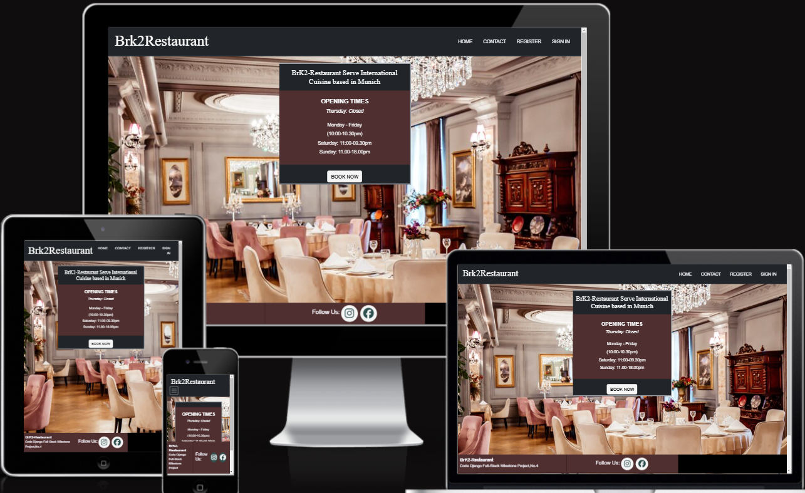
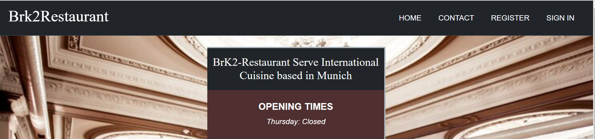
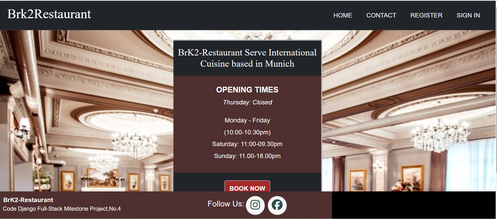
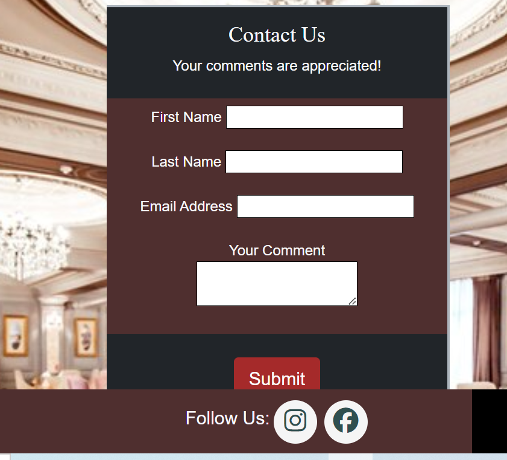
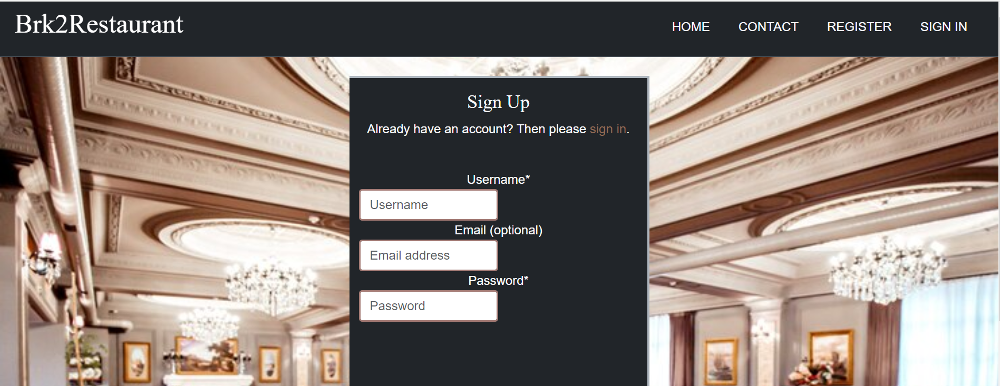
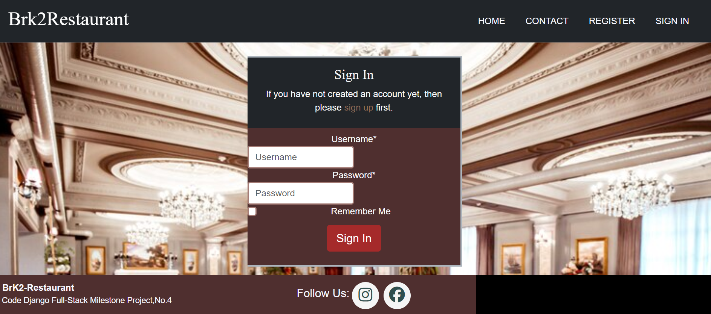
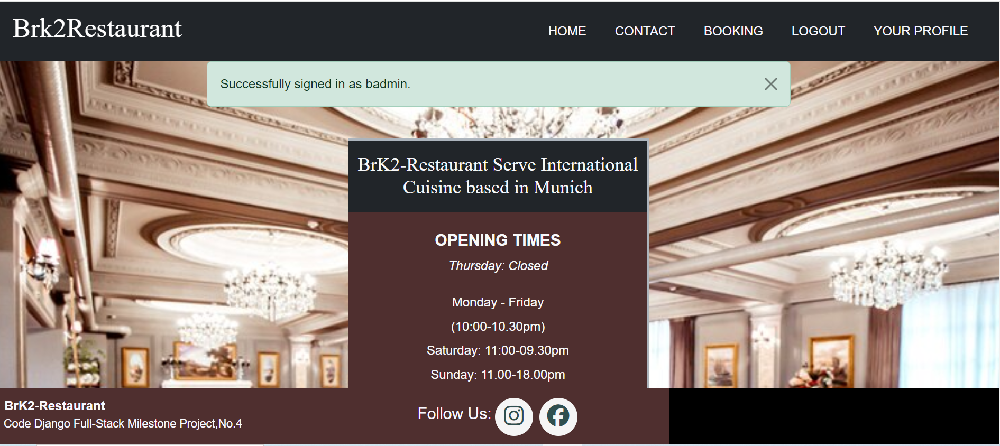
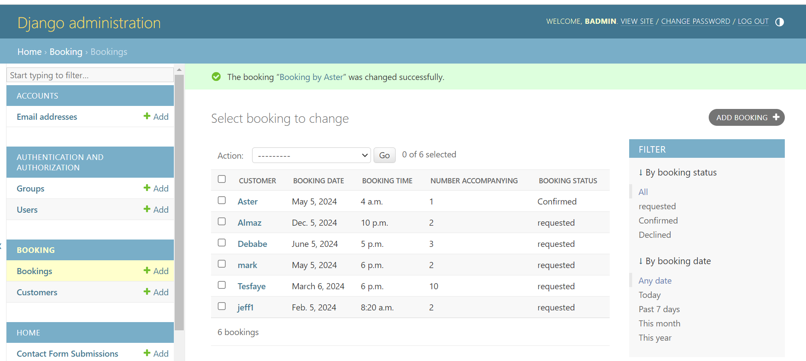
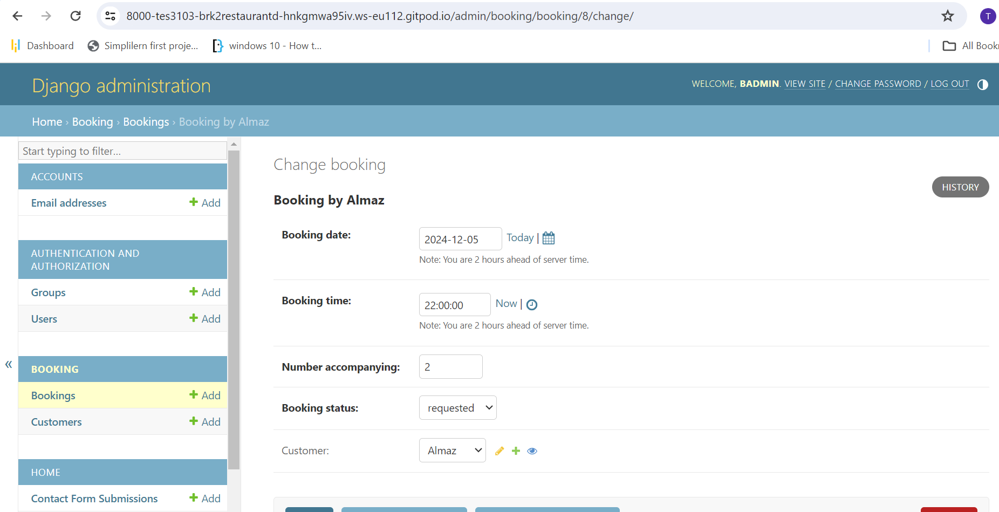

#  BrK2-Restaurant
Brk2-Restaurant is an imaginary Restaurant based in Munich Germany created for the Purpose of creating a full functioning Booking app for the school project tollkit Full-Stuck Django milestone Project.

This website displays information to the user such as opening times, Users are able to create an account on this website.Once a user is logged in they are able to make a request for a booking also able to edit or delete their booking by visiting their profile page. An authorized user can also edit the personal profile. The site also have the access for  managers to oversee the bookings of all users so that they can properly run the restaurant.

A live version of the project can be accessed [here:](https://dashboard.heroku.com/apps/brk2restaurant-2024/deploy/github)

 
## User Experiance Design

## User Demographic

This Site Targes Users who are:

* Looking for an international food taste
* Forigners who live in Munich and miss their Original Tasete of Food
* Turists from all over the world who are looking for an international experiance

## User Stories

* As a User of this website I want to see a home page which give me a general information
* As a user of this website I want to create an account so that i can have the access
* As a User of This website I want to  have an access to book or reserve for my comming dates
* As a User I want to see a conformation message so that my booking is accepted for further conformation
* As a User of This website i want to Edit, and delete my booking Schedule
* As a User of this Website I want to edit or delete my usser Profile Information
* As an Admin Of the website i want to access all Bookings and arrange for further management

## Skeleton

## Wireframe
Wireframe are used to give a visual feedback afer taking the general structure of the site and they also help as a remnder for the basic components of the site

Home

Booking

### Flowchart

This flowchart was created to determine the flow of the website. It shows which pages are available to the user. It takes into account if the user is logged in to the website or not.

## Technologies used

* *Django* - The Django framework was used to develop this application.
* *Django AllAuth* - Used to create account, login and logout users of the site.
* *Python* - This application was developed using Python.
* *ElephantSQL* - was used to host the external database.
* *HTML* - was used to develop the templates in this project.
* *CSS* - was used to style the page by customizing it.
* *Lucid chart* - Used to create the flowchart.
* *Bootstrap* - was used for the fast development of the layout and styling
* *Gitpod* - IDE used for the development of the  application.
* *jQuery* - jQuery was used to develop the date and time pickers.
* *GitHub* - The code for this application is stored on GitHub.
* *Git* - Used for version control.
* *Heroku* - Used for development.
* *JavaScript* -

## Features

## Existing features

### Navigation bar

* Links alter depending on which section of the site the user is accessing.
* The navigation bar is seen on all pages of this booking site.
* Navbar toggler appears at screen sizes of 746px or less to preserve well-formatted layout.
* To the left hand side of the navigation bar the name and the logo for café-board can be seen. This logo is clickable and will return the user back to the home page.

### Home Page

* A home page also displaying a quick link to the booking area of the site.
* A home page with a background image displaying opening times of the restaurant.
* A home page renders well for all screen sice media.

### Contact Us Page

* The contact us link opens a form for the user to fill out.
* The user is asked for their name, email and the message they would like to send.
* The Booking admin adress all the issues rasied by the user as quickly as possible.

### Register Page

* This link allows a User to Sign up for the page and 
* A registerd User has all the access for booking and additional previllages
* A User is expected to fill all the required Fild and a conformation massage will show the Success.

### Sign-in Page

* A user can sign in using a registerd credentials 
* After the user sign in the user can book, visit the profile and able to perform edition and deletion 
* A signd in User have the following Options

### Booking Admin

* An admin area only allowing access to the site admin
* A link to the database to clearly display the details of each booking
* Username and password details must be entered to gain access and able to manage booking

## Future features

1. Adding a menu and gallary page
2. Adding More interaction by implementing jS functionality
3. Improving the booking steps by adding Pictures of the setting arrangement
4. Automatic email notifications for admin when customers make bookings and notifications to customers when booking status is updated
5. A forgotten password link

## Testing

### Manual testing

Each section of the website has been tested.Testing different devices and screen resolutions has been conducted using Google DevTools.

#### Navigation Bar

**Test**|**Action**|**Expected**|**Result**
-----|-----|-----|:-----:
Logo|Clicked logo|When the logo is clicked it will return the user to the home page|pass
Home nav link|Clicked Home on the nav bar|When clicked it will direct the user to the home page|pass
Contact-Us nav link|Clicked Contact-Us on the nav bar|When clicked it will direct the user to the Contact-us|Pass
Register nav link|Clicked Register on the nav bar|When clicked it will direct the user to the sign up page|Pass
Sign in nav link|Clicked Sign in on the nav bar|When clicked it will direct the user to the sign in page|Pass
Nav menu responsive|Change the Device Size|When browser is resized the nav bar will remain responsive across all device sizes|Pass

#### Contact Us

**Test**|**Action**|**Expected**|**Result**
-----|-----|-----|:-----:

